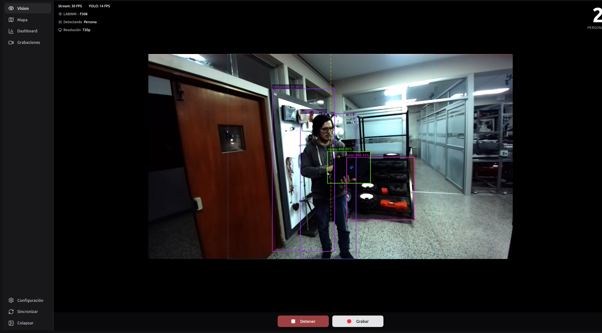
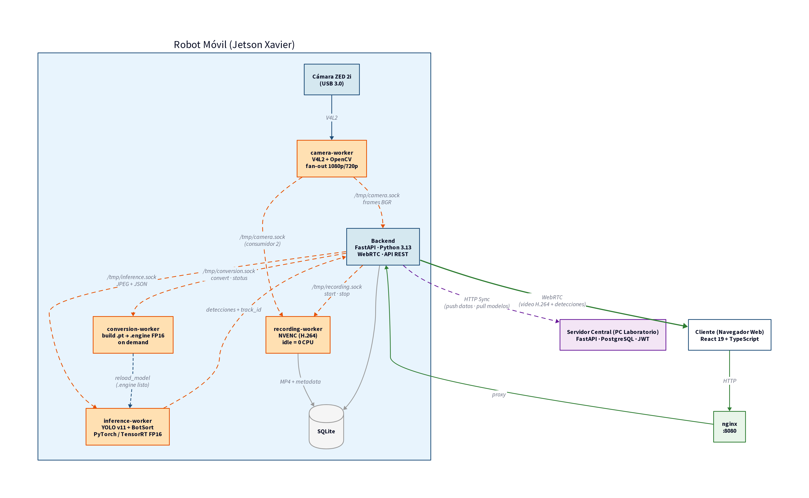

<h1 align="center">Robot Platform</h1>

<p align="center">
  
</p>

Plataforma de software para un robot móvil agrícola que detecta, cuenta y clasifica frutos en tiempo real. Se ejecuta sobre una NVIDIA Jetson Xavier embebida en el robot y se opera desde cualquier dispositivo conectado a su red WiFi.

## Arquitectura



El sistema se compone de un backend FastAPI que coordina cuatro workers independientes que se comunican por sockets Unix:

- **camera-worker:** captura V4L2 sobre cámara ZED 2i, fan-out a múltiples consumidores.
- **inference-worker:** detección YOLO con seguimiento BoT-SORT, soporta TensorRT FP16.
- **recording-worker:** codificación H.264 con NVENC sobre Jetson.
- **conversion-worker:** construcción de engines TensorRT FP16 a partir de modelos `.pt`.

El frontend (React + TypeScript + Vite) se sirve estático por nginx y se entrega al operador a través de un celular o tablet.

El sistema opera en dos modos seleccionables por la variable `ROBOT_MODE`:

- **`robot`:** corre en la Jetson embebida, ejecuta captura, inferencia, grabación y sincronización.
- **`server`:** corre en una computadora del laboratorio, administra usuarios, modelos y dispositivos, y recibe la sincronización de los robots.

## Hardware

- **Robot:** NVIDIA Jetson Xavier (JetPack 5.1), cámara estéreo ZED 2i.
- **Servidor:** PC con Linux, PostgreSQL 16.

## Desarrollo local

### Solo modo robot

```bash
# terminal 1: inference worker
make run-inference-dev

# terminal 2: backend → localhost:8080
make run-robot

# terminal 3: frontend → localhost:5173
make run-front
```

### Robot y servidor en paralelo

```bash
make run-inference-dev   # terminal 1
make run-robot           # terminal 2 → :8080
make run-server          # terminal 3 → :9090 (levanta PostgreSQL)
make run-front           # terminal 4 → :5173
make run-front-server    # terminal 5 → :5174
```

> Primera vez con el servidor: ejecutar `make db-migrate` antes de `make run-server`.

## Despliegue en producción

```bash
make deploy-robot    # nginx + systemd, SQLite, puerto 8080
make deploy-server   # nginx + systemd + PostgreSQL, puerto 9090
```

Operación:

```bash
make status          # estado de los servicios
make logs            # logs del backend
make logs-inference  # logs del inference-worker
make restart         # reiniciar servicios
make update          # git pull + rebuild + restart
```

## Exponer el server a internet (Tailscale Funnel)

El backend en modo `server` corre por defecto en `127.0.0.1:9090`. Para que sea alcanzable desde fuera de la red del laboratorio sin comprar dominio ni configurar firewall, se usa Tailscale Funnel.

### Requisitos previos (una vez por máquina)

```bash
curl -fsSL https://tailscale.com/install.sh | sh
sudo tailscale up
```

El segundo comando imprime una URL de autenticación. Abrirla en el navegador y autenticar con la cuenta del laboratorio.

En el panel https://login.tailscale.com/admin/dns activar:
- **MagicDNS**
- **HTTPS Certificates**

Verificar el hostname asignado:

```bash
tailscale status --json | python3 -c "import json,sys; print(json.load(sys.stdin)['Self']['DNSName'])"
```

### Activar el acceso público

Con el backend corriendo (`make run-server` o `make deploy-server`):

```bash
sudo tailscale funnel --bg 9090
```

`tailscale funnel status` muestra la URL pública (formato `https://<host>.<tailnet>.ts.net`).

`make deploy-server` automatiza este paso: detecta el hostname, renderiza nginx con TLS sobre los certificados de Tailscale, y activa el funnel.

### Crear el primer admin

El server arranca sin usuarios por defecto. Crear el primer admin con:

```bash
make create-admin
```

El script pide username y password por stdin (no se persisten en `.env` ni en logs).

### Apagar el acceso público

```bash
sudo tailscale funnel --https=443 off
```

Más detalles y troubleshooting en [`deploy/README.md`](deploy/README.md).

## Agradecimientos

Este trabajo es financiado por el Programa Nacional de Investigación Científica y Estudios Avanzados (**PROCIENCIA**) en el marco del proyecto **PE5010-86701-2024-PROCIENCIA**: *"Desarrollo e implementación de un robot móvil multifuncional reconfigurable mecánicamente para adaptarse a fundos agrícolas con diferentes camellones y entre surcos variables de la Región La Libertad-Perú"*.

Se agradece al fundo Danper por facilitar el acceso a sus campos para la recolección de datos y a la Universidad Privada Antenor Orrego (UPAO) por el respaldo institucional al proyecto.
