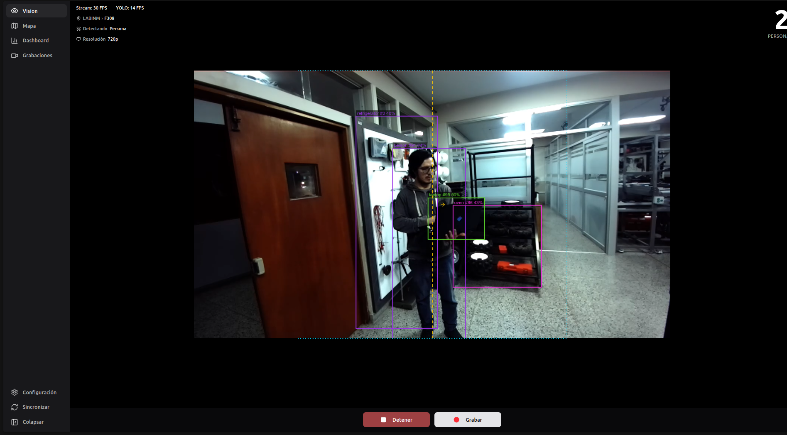

<h1 align="center">Robot Platform</h1>

<p align="center">Software platform for mobile robots to detect and count objects in real time.</p>

<p align="center">
  
</p>

## Features

- Camera source support: USB/V4L2 devices and IP cameras via RTSP URL.
- Real-time fruit detection and counting using YOLO + BoT-SORT tracking,
  accelerated with TensorRT FP16 on Jetson.
- Live video streaming over WebRTC (H.264 NVENC) to any device on the local WiFi
  network.
- Session recording with H.264 video and per-frame detection overlays,
  replayable from the web UI.
- Configurable counting lines and ROI zones; per-session statistics synced to
  the lab server.
- Two-mode architecture: embedded robot (Jetson + SQLite) and lab server
  (Docker + PostgreSQL), kept in sync automatically.
- Model management: upload `.pt` weights on the server, convert to TensorRT
  engine on the robot.

## Development

The platform has two main components that run independently:

**Server** runs on a lab PC, manages users, models, and devices, and receives
sync from robots.

```bash
make compose-build
make compose-up      # start server (Docker Compose)
make compose-logs    # follow logs
make compose-down    # stop
```

**Mobile robot** runs on the embedded NVIDIA Jetson Xavier, captures video, runs
inference, and records sessions.

```bash
make run-robot       # backend → :8080
make run-camera      # camera worker
make run-recording   # recording worker
make run-inference   # inference worker
make run-front       # frontend → :5173
```

## Installation

### Server

Requirements: Docker, Docker Compose, Git.

```bash
cp .env.server.example .env.server   # set SECRET_KEY, DB credentials, etc.
make compose-build
make compose-up
make compose-migrate
make compose-create-admin
```

### Robot (Jetson Xavier, JetPack 5.1)

Requirements: Python 3.10+, `uv`, GStreamer with `nvv4l2h264enc`, ZED SDK.

```bash
cp .env.robot.example .env.robot   # set camera, server URL, etc.
make deploy-robot                  # installs nginx + systemd services
```

Subsequent updates:

```bash
make update   # git pull + rebuild + restart
```

## Docs

- [Architecture](docs/architecture.md): system design, workers, modes, Unix
  sockets.
- [Local development](docs/development.md): running robot and server locally.
- [Tailscale Funnel](docs/tailscale.md): exposing the server to the internet.
- [Roadmap](spec/roadmap.md): active and upcoming phases.
- [Backlog](spec/backlog.md): improvements without a phase yet.

## Acknowledgements

This work is funded by the National Program for Scientific Research and Advanced
Studies (**PROCIENCIA**) under project **PE5010-86701-2024-PROCIENCIA**:
_"Development and implementation of a mechanically reconfigurable
multifunctional mobile robot to adapt to agricultural farms with different
ridges and variable inter-row spacing in the La Libertad region, Peru"_.

We thank Danper farm for providing field access for data collection, and
Universidad Privada Antenor Orrego (UPAO) for institutional support.
