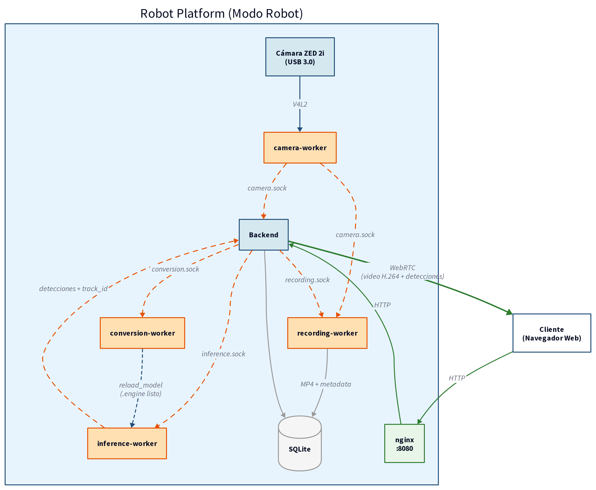

# Architecture

The backend is a FastAPI process that coordinates four independent workers communicating over Unix sockets:

- **camera-worker:** V4L2 capture (USB or RTSP), fan-out to multiple consumers.
- **inference-worker:** YOLO detection with BoT-SORT tracking, supports TensorRT FP16.
- **recording-worker:** H.264 encoding with NVENC on Jetson.
- **conversion-worker:** builds TensorRT FP16 engines from `.pt` model files.

The frontend (React + TypeScript + Vite) is served statically by nginx and accessed from any device on the local network.

## Modes

The system runs in two modes selected by `ROBOT_MODE`:

- **`robot`:** runs on the embedded Jetson; handles capture, inference, recording, and sync.
- **`server`:** runs on a lab PC; manages users, models, and devices, and receives sync from robots.

## Hardware

- **Robot:** NVIDIA Jetson Xavier (JetPack 5.1), ZED 2i stereo camera.
- **Server:** Linux PC, PostgreSQL 16.

## Unix sockets

| Socket | Purpose |
|--------|---------|
| `/tmp/camera.sock` | Raw BGR frames. Control: `/tmp/camera-control.sock` |
| `/tmp/inference.sock` | JPEG input, JSON detections output |
| `/tmp/recording.sock` | Start/stop/status control |
| `/tmp/conversion.sock` | Convert/status control |
